# 🎓 **Software Engineering Group 6 Section 4** 🎓  

ยินดีต้อนรับสู่โครงการของ **Software Engineering Group 6 Section 4** 🚀  

## 👥 **สมาชิกกลุ่ม**  
1. **นางสาวสิริยากร เอกศิริ**  
2. **นายณัฐภัทร ตรงวัฒนาวุฒิ**  
3. **นายอัฏฐวัฒน์ คำมาศ**  
4. **นายพรศิลป์ ศรีอุฬารวัฒน์**  
5. **นางสาวสุชญา พานสมภพ**  
6. **นายธนวัฒน์ ถนัดค้า**  
7. **นายพงษ์วรินทร์ แก้วสง่า**  

---  

## 📌 **เกี่ยวกับโครงการ**  
GitHub Repository นี้เป็นส่วนหนึ่งของรายวิชา **CP353004 - Principle of Software Design and Development**  

📚 **อาจารย์ผู้สอน:**  
👨‍🏫 **ผศ.ดร. [ชิตสุธา สุ่มเล็ก](https://scholar.google.co.th/citations?user=ghQ1lTAAAAAJ&hl=en)**  

📌 **ตำแหน่งทางวิชาการ:** *ผู้ช่วยศาสตราจารย์*  
📌 **ตำแหน่งบริหาร:** *รองคณบดีฝ่ายวิจัยและนวัตกรรม*  

📧 **Email:** [chitsutha@kku.ac.th](mailto:chitsutha@kku.ac.th)  
🌍 **Personal Website:** [คลิกที่นี่](https://sites.google.com/a/kku.ac.th/chitsuthasoomlek)  

---

✨ **Repository นี้จัดทำขึ้นเพื่อศึกษาและพัฒนาทักษะด้านการออกแบบและพัฒนาซอฟต์แวร์ร่วมกันเป็นทีม** ✨  

💡 *“Together, we learn more than build.”* 💡  

---

## 📌 **วิธีใช้งาน Repository นี้**  
🔹 Clone หรือ Fork Repository นี้ไปยังเครื่องของคุณ  
```sh
git clone git@github.com:kku-computer-science/git-group-repository-group-6-sec-4-1.git
```
🔹 เปิด cmd แล้วแข้าไปที่โฟล์เดอร์ git-group-repository-group-6-sec-4-1\InitialProject\Source Code

```sh
cd YOUR_STORAGE_PATH/git-group-repository-group-6-sec-4-1/InitialProject/Source Code
```

🔹 จากนั้นใช้คำสั่ง เพื่อสร้างตารางใน Database
```sh
php artisan migrate
```

🔹 หลังจากสร้างตารางใน Database เสร็จสามารถใช้
```sh
php artian serve 
```
เพื่อเรียกเปิดใช้งาน server บน localhost ที่ port 8000 สามารถเข้าถึงได้ที่

[localhost:8000](https://localhost:8000/)

## 📌 **เมื่อเราเข้าสู่ระบบจัดการข้อมูลวิจัยของสาขาวิชาวิทยาการคอมพิวเตอร์ **  
จะแสดงหน้า Login โดยกรอก
USERNAME และ PASSWORD <br>
 <br>
<br>
✨ **USERNAME : admin@gmail.com
✨ **PASSWORD : 12345678

<br>

## เมื่อเข้าสู่ระบบโดย Admin มาแล้วจะแสดงหน้า Dashbord ที่เป็นการแสดงภาพรวมของ Log ทั้งหมดที่เกิดขึ้น **
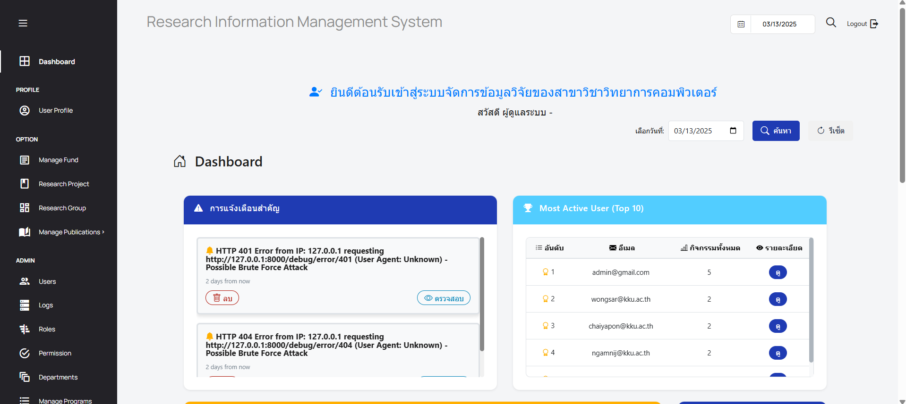 <br>
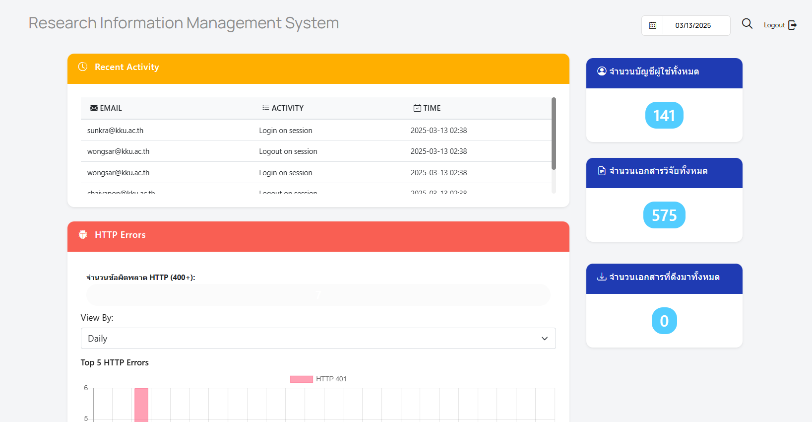 <br>
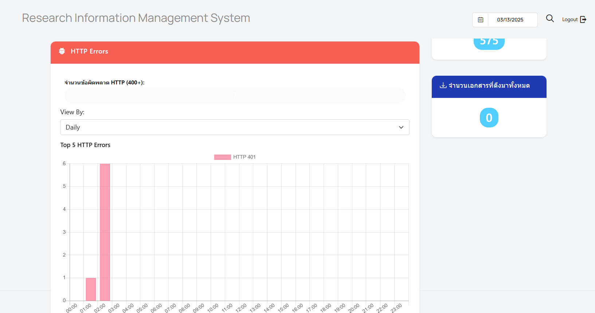 <br>


🔹 เข้าไปที่ :  การแจ้งเตือนสำคัญ <br>
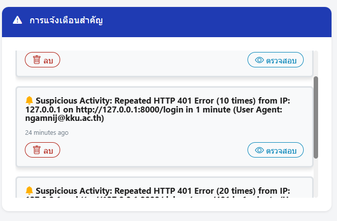 <br>
เมื่อเข้ามาดูที่การ์ดนี้จะแสดงการแจ้งเตือนที่สำคัญ เช่น อาจารย์มีการเข้ารหัสผิดเป็นจำนวนมาก <br>
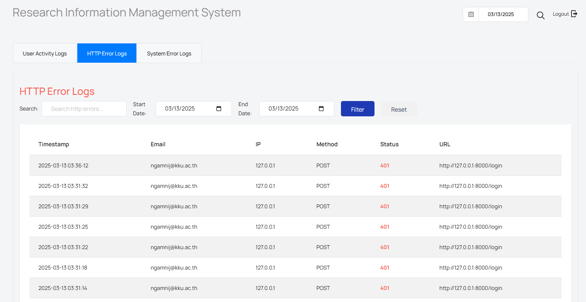 <br>
เมื่อกดที่ตรวจสอบ จะแสดงรายละเอียด Timestamp ,	Email	IP , Method,	Status และURL

-  -  -

🔹** เข้าไปที่ :  Most Active User (Top 10) <br>
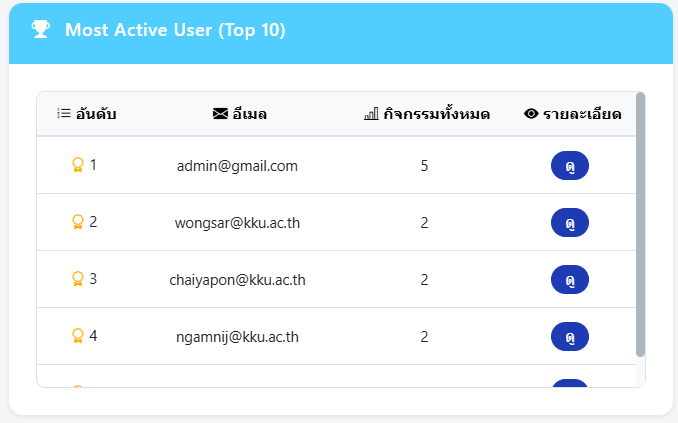 <br>
จะแสดงผู้ใช้ที่ใช้งานมากที่สุด (10 อันดับแรก)<br>
<br>
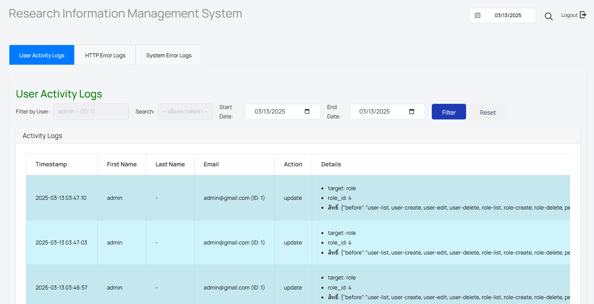 <br>
<br>
เมื่อเข้าไปดูจะพบว่า Admin มีการใช้งานมากที่สุด !!!
-  -  -

🔹 เข้าไปที่ :  Recent Activity <br>
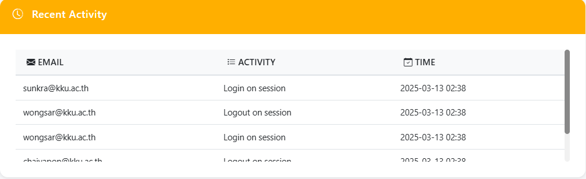 <br>
จะแสดงกิจกรรมล่าสุดของผู้ใช้ว่าทำอะไรไปล่าสุด <br>


-  -  -

🔹 เข้าไปที่ :  จำนวนบัญชีผู้ใช้ทั้งหมด <br>
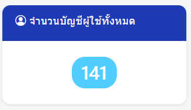 <br>
จะแสดงจำนวนผู้ใช้ทั้งหมดของระบบ <br>
<br>
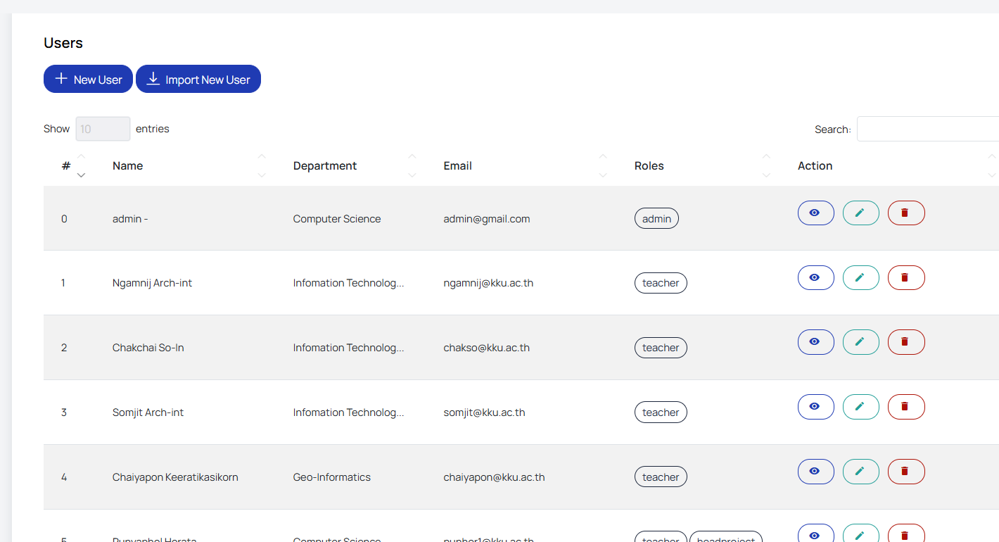 <br>
-  -  -

🔹 เข้าไปที่ :  จำนวนเอกสารวิจัยทั้งหมด <br>
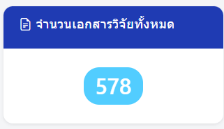 <br>
จะแสดงจำนวนเอกสารวิจัยทั้งหมดของระบบ <br>
<br>
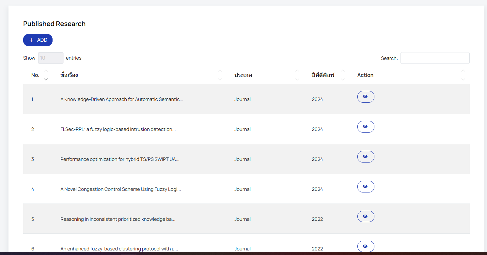 <br>
-  -  -

🔹 เข้าไปที่ :  จำนวนเอกสารที่ดึงมาทั้งหมด <br>
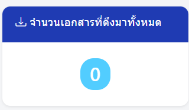 <br>
จะแสดงจำนวนเอกสารที่ได้ทำการดึงมาทั้งหมด <br>
<br>
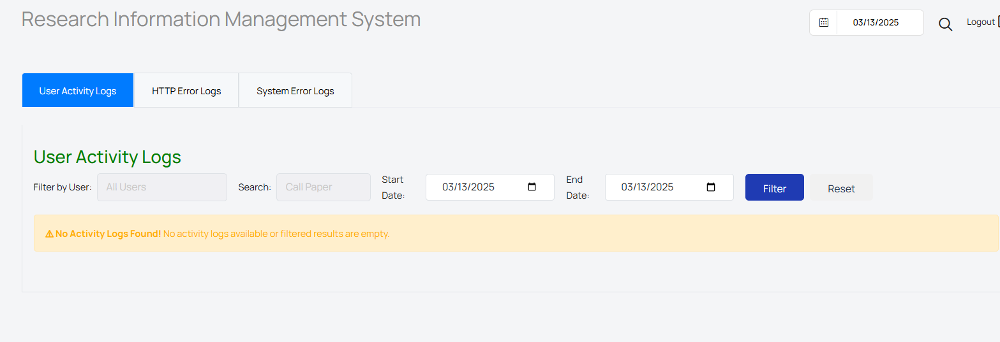 <br>
-  -  -

🔹 เข้าไปที่ :   HTTP Errors <br>
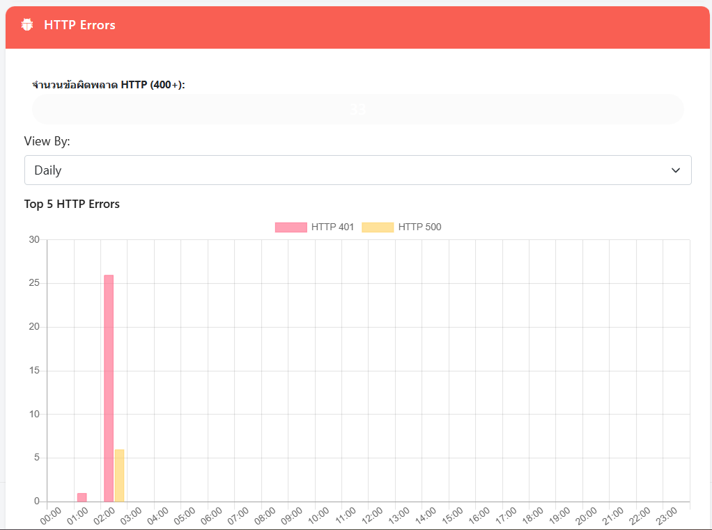 <br>
จะแสดงกราฟความผิดพลาดต่างๆของระบบ ที่สามารถ เลือกการแสดงผลได้ 
- Daily
- Weekly
- Monyhly

## เมื่อเข้าไปที่เมนู Log ของ Admin ** <br>
จะมีการแสดงอยู่ 3 แถบเมนูด้วยกันคือ User Activity Logs , HTTP Error Logs และ System Error Logs
🔹 เข้าไปที่ :   User Activity Logs <br>
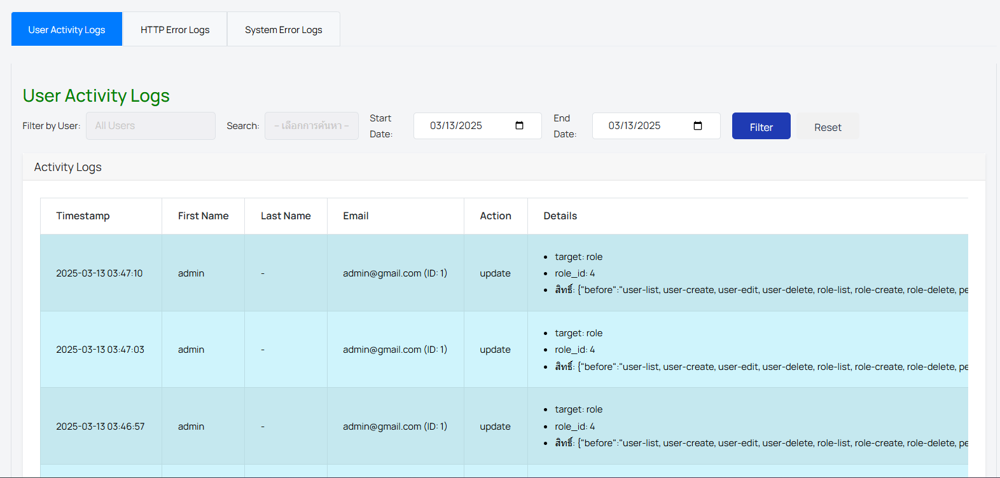 <br>

- - -

🔹 เข้าไปที่ :   HTTP Error Logs <br>
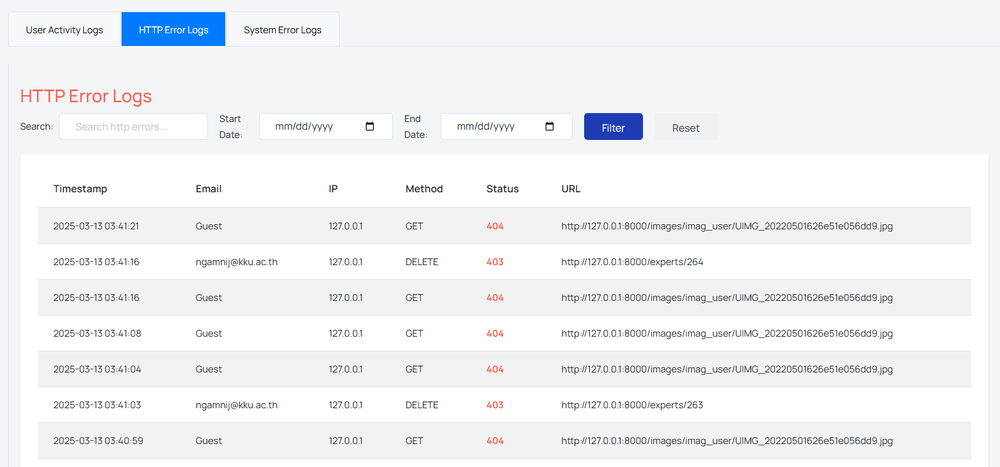 <br>

- - -

🔹 เข้าไปที่ :   System Error Logs <br>
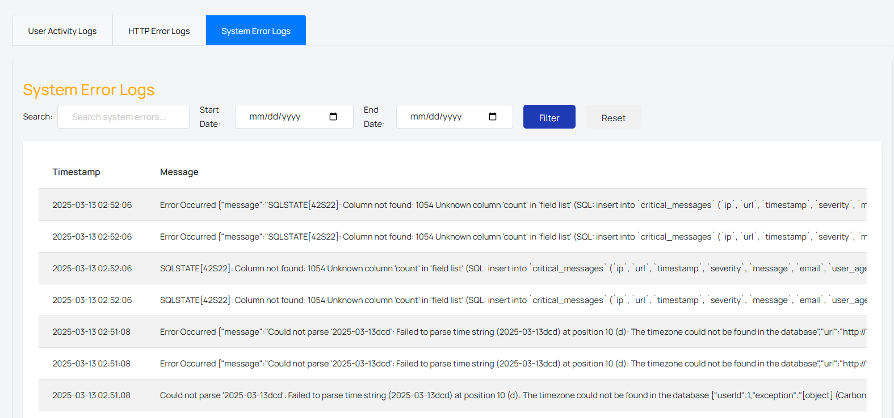 <br>

- - -

จะแสดงหน้า Login โดยกรอก
USERNAME และ PASSWORD <br>
 <br>
<br>
✨ **USERNAME : ngamnij@kku.ac.th
✨ **PASSWORD : 123456789

<br>
## เมื่อเข้าสู่ระบบโดย User มาแล้วจะแสดงหน้า Dashbord ของ User **
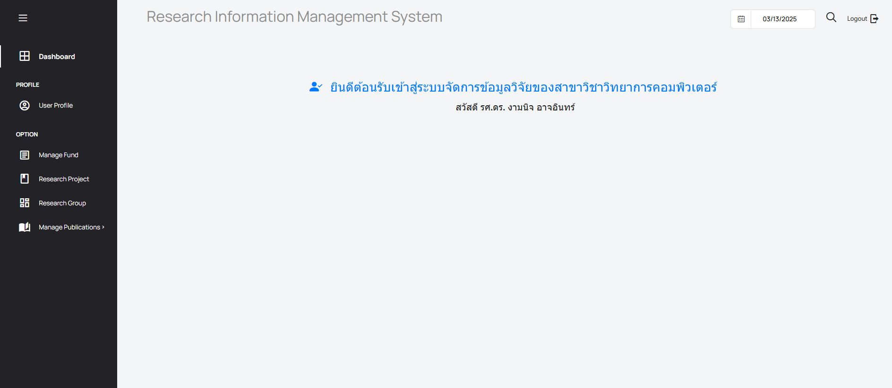 <br>
แสดงยินดีต้อนรับเข้าสู่ระบบจัดการข้อมูลวิจัยของสาขาวิชาวิทยาการคอมพิวเตอร์
สวัสดี รศ.ดร. งามนิจ อาจอินทร์
<br>

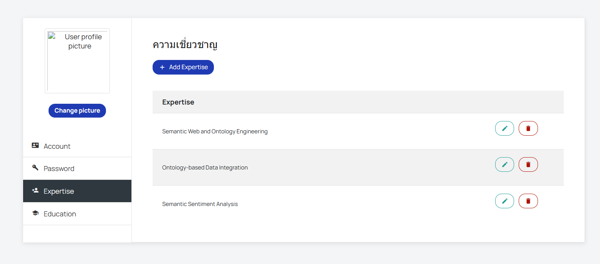 <br>
ผู้ใช้สามารถแก้ไขข้อมูลหรือเปลี่ยนแปลงข้อมูลได้
<br>
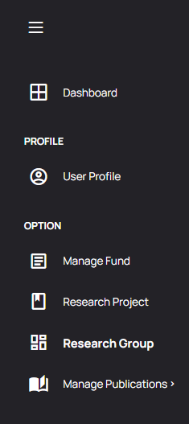 <br>
ผู้ใช้สามารถใช้งานฟังก์ชันต่างๆของระบบจัดการข้อมูลวิจัยของสาขาวิชาวิทยาการคอมพิวเตอร์ หาทำการเปลี่ยนแปลงใด ข้อมูลต่างๆก็จะแสดงที่ส่วนของ Log ของ Admin ครับ... <br>

***


