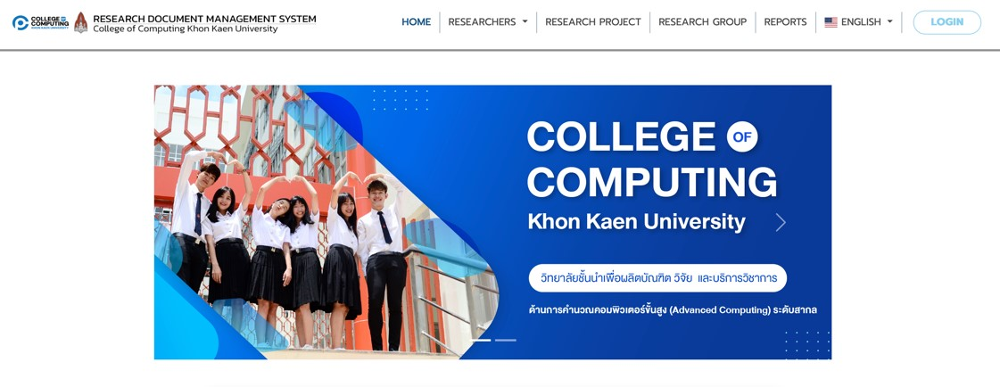
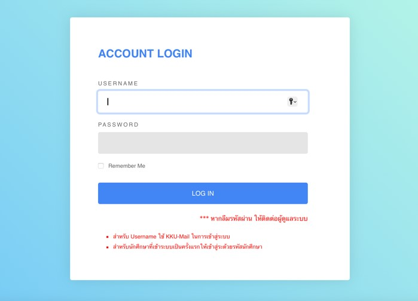
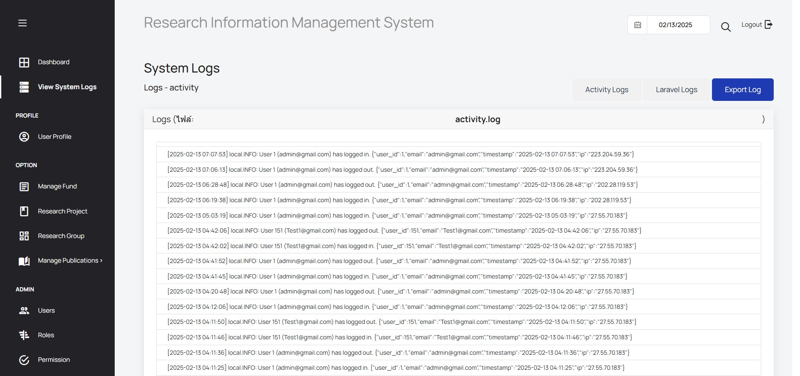
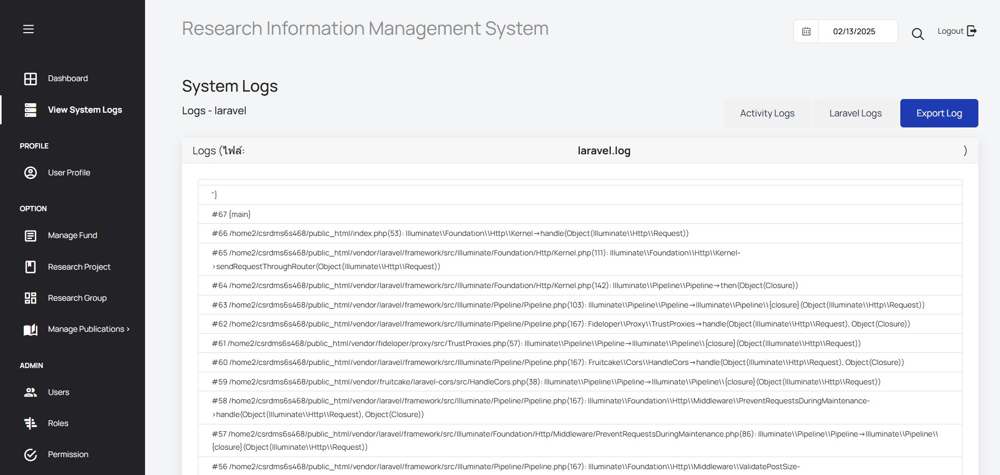
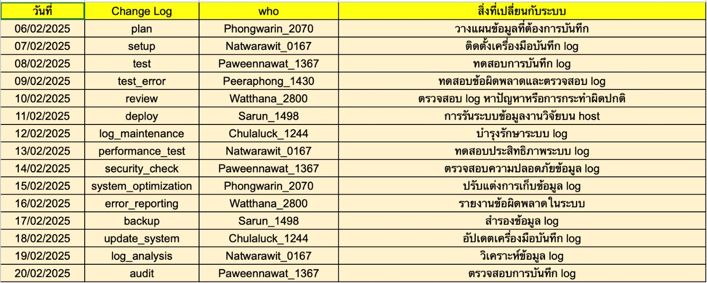

# คู่มือการใช้งานระบบ(User Manual)

## 1. การในฐานะผู้ดูแลระบบ ฉันต้องการดูบันทึกของระบบ 
User Manual
คู่มือการใช้งาน System Log
สารบัญ
1.	ข้อมูลเบื้องต้น
2.	รายละเอียดฟีเจอร์
3.	วิธีการใช้งาน

ข้อมูลเบื้องต้น System Log
ใช้สำหรับติดตามและแสดงบันทึกกิจกรรมที่เกิดขึ้นในระบบ เช่น การลงชื่อเข้าใช้ (Login), การลงชื่อออก (Logout) และกิจกรรมต่าง ๆ ที่ผู้ใช้ (User) และผู้ดูแลระบบ (Admin) ดำเนินการ
รายละเอียดฟีเจอร์
- แสดงประวัติการใช้งานของระบบ
- กรองข้อมูล Log ตามประเภทของกิจกรรม
- ค้นหาข้อมูล Log ตามวันที่หรือคำสำคัญ
- ตรวจสอบสถานะของแต่ละกิจกรรม (Success / Failed)

วิธีการใช้งาน การตรวจสอบ Log
1.	คลิกเมนู Login เพื่อไปยังหน้าเข้าสู่ระบบ

2.เข้าสู่ระบบด้วยบัญชี Admin
 
 
USERNAME : admin@gmail.com
PASSWORD : 123456789

3.ไปที่เมนู View System Logs
 

4.สามารถดูรายละเอียดกิจกรรมของทุก User ได้
 

5.สามารถดูรายละเอียดข้อผิดพลาดและข้อความที่เกี่ยวข้องกับระบบได้
 

Change Log
 

